# Database schema tree (FitConnect)

Візуальна карта сутностей і зв'язків. Деталі колонок — у [DB_STRUCTURE.md](DB_STRUCTURE.md). 40 таблиць згруповані по 16 модулях, що відповідають [features/](features/).

---

## 1. ER-діаграма (Mermaid)

```mermaid
erDiagram
    %% --- Identity & Auth ---
    users ||--o{ refresh_tokens : has
    users ||--o{ oauth_identities : has
    users ||--o{ email_verifications : has
    users ||--o{ password_resets : has
    users ||--o{ email_change_requests : has
    users ||--o{ audit_logs : performs
    users ||--o{ data_exports : requests
    users ||--o| onboarding_progress : tracks

    %% --- Notifications & Files ---
    users ||--o{ device_tokens : owns
    users ||--o{ notifications : receives
    users ||--o{ media_files : uploads

    %% --- CRM ---
    users ||--o{ clients : trainer_owns
    clients }o--o| users : client_account
    clients ||--o{ client_invitations : invited_via

    %% --- Programs & Exercises ---
    users ||--o{ exercises : owns
    users ||--o{ programs : owns
    programs ||--o{ program_exercises : has
    exercises ||--o{ program_exercises : in
    programs ||--o{ program_videos : has
    program_videos }o--o| media_files : file
    programs ||--o{ program_likes : liked_by
    users ||--o{ program_likes : likes
    clients ||--o{ client_programs : assigned
    programs ||--o{ client_programs : to_clients
    programs }o--o| media_files : cover
    exercises }o--o| media_files : video

    %% --- Sessions ---
    users ||--o{ sessions : trainer
    sessions ||--o{ session_participants : has
    clients ||--o{ session_participants : attends
    users ||--o{ session_series : owns
    session_series ||--o{ sessions : materializes
    sessions }o--o| programs : optional_program
    sessions }o--o| client_packages : optional_link

    %% --- Workout Tracking ---
    sessions ||--o| workout_logs : tracked_by
    workout_logs ||--o{ workout_log_exercises : has
    exercises ||--o{ workout_log_exercises : referenced
    workout_log_exercises ||--o{ workout_log_sets : has
    workout_logs ||--o{ workout_log_sets : has
    exercises ||--o{ workout_log_sets : performed

    %% --- Chat ---
    users ||--o{ conversation_participants : participates
    conversations ||--o{ conversation_participants : has
    conversations ||--o{ messages : has
    users ||--o{ messages : sends
    messages }o--o{ media_files : attached

    %% --- Packages ---
    users ||--o{ package_templates : owns
    clients ||--o{ client_packages : assigned
    package_templates ||--o{ client_packages : instantiated
    users ||--o{ client_packages : trainer_denorm

    %% --- Transactions ---
    users ||--o{ transactions : trainer
    clients ||--o{ transactions : optional_client
    client_packages ||--o| transactions : paid_by
    users ||--o{ withdrawals : trainer

    %% --- Progress ---
    clients ||--o{ body_measurements : tracks
    users ||--o{ body_measurements : recorded_by
    clients ||--o{ personal_records : achieves
    exercises ||--o{ personal_records : on
    workout_log_sets ||--o| personal_records : source

    %% --- Integrations ---
    users ||--o{ calendar_integrations : has
    sessions }o--o| calendar_integrations : synced_to_google

    %% --- Analytics ---
    users ||--o{ profile_view_events : viewed
    users ||--o{ analytics_cache : trainer
    users ||--o{ achievements : earned
```



---

## 2. Логічні шари (модулі)

Окремі блоки — групування по модулях [features/](features/), не окремі БД-схеми.

```mermaid
flowchart TB
    subgraph L0Auth [0. Auth and Identity]
        users
        refresh_tokens
        oauth_identities
        email_verifications
        password_resets
        email_change_requests
        audit_logs
        data_exports
    end

    subgraph L0OnbFilesNotif [0. Onboarding, Files, Notifications]
        onboarding_progress
        media_files
        device_tokens
        notifications
    end

    subgraph L1CRM [1. CRM, Programs, Sessions]
        clients
        client_invitations
        exercises
        programs
        program_exercises
        program_videos
        program_likes
        client_programs
        sessions
        session_participants
        session_series
    end

    subgraph L2RealTime [2. Real-time, Workouts, Integrations]
        conversations
        conversation_participants
        messages
        workout_logs
        workout_log_exercises
        workout_log_sets
        calendar_integrations
    end

    subgraph L3Business [3. Business: Packages, Transactions, Progress, Analytics]
        package_templates
        client_packages
        transactions
        withdrawals
        body_measurements
        personal_records
        profile_view_events
        analytics_cache
        achievements
    end

    L0Auth --> L0OnbFilesNotif
    L0Auth --> L1CRM
    L0OnbFilesNotif --> L1CRM
    L1CRM --> L2RealTime
    L1CRM --> L3Business
    L2RealTime --> L3Business
```



---

## 3. Таблиці по модулях (40 шт.)

### 3.1 Auth & Identity ([features/auth.md](features/auth.md))

| Таблиця | Зв'язок | Кратність |
|---|---|---|
| `users` | коренева сутність | 1 |
| `refresh_tokens` | `user_id` → `users` (CASCADE) | N:1 |
| `oauth_identities` | `user_id` → `users` (CASCADE) | N:1 |
| `email_verifications` | `user_id` → `users` (CASCADE) | N:1 |
| `password_resets` | `user_id` → `users` (CASCADE) | N:1 |
| `email_change_requests` | `user_id` → `users` (CASCADE) | N:1 |
| `audit_logs` | `user_id` → `users` (SET NULL) | N:1 |
| `data_exports` | `user_id` → `users` (CASCADE), `file_id` → `media_files` | N:1 |

### 3.2 Onboarding ([features/onboarding.md](features/onboarding.md))

| Таблиця | Зв'язок | Кратність |
|---|---|---|
| `onboarding_progress` | `user_id` → `users` (CASCADE) | 1:1 |

### 3.3 Users & Profile ([features/users.md](features/users.md))

Без окремих таблиць — поля профіля у `users`.

### 3.4 Files & Media ([features/files.md](features/files.md))

| Таблиця | Зв'язок | Кратність |
|---|---|---|
| `media_files` | `owner_user_id` → `users` (SET NULL) | N:1 |

### 3.5 Notifications ([features/notifications.md](features/notifications.md))

| Таблиця | Зв'язок | Кратність |
|---|---|---|
| `device_tokens` | `user_id` → `users` (CASCADE) | N:1 |
| `notifications` | `recipient_user_id` → `users` (CASCADE) | N:1 |

### 3.6 Clients (CRM) ([features/clients.md](features/clients.md))

| Таблиця | Зв'язок | Кратність |
|---|---|---|
| `clients` | `trainer_id` → `users` (CASCADE), `user_id` → `users` (SET NULL, optional) | N:1 |
| `client_invitations` | `client_id` → `clients` (CASCADE), `trainer_id` → `users` | N:1 |

### 3.7 Programs ([features/programs.md](features/programs.md))

| Таблиця | Зв'язок | Кратність |
|---|---|---|
| `programs` | `trainer_id` → `users` (CASCADE), `cover_file_id` → `media_files` | N:1 |
| `program_exercises` | `program_id` → `programs` (CASCADE), `exercise_id` → `exercises` (SET NULL) | N:1 |
| `program_videos` | `program_id` → `programs` (CASCADE), `media_file_id` → `media_files` | N:1 |
| `program_likes` | `(program_id, user_id)` composite PK | M:N |
| `client_programs` | `client_id` → `clients` (CASCADE), `program_id` → `programs` (SET NULL); містить `program_snapshot jsonb` | M:N |

### 3.8 Exercises ([features/exercises.md](features/exercises.md))

| Таблиця | Зв'язок | Кратність |
|---|---|---|
| `exercises` | `trainer_id` → `users` (CASCADE), `video_file_id` → `media_files` | N:1 |

### 3.9 Sessions & Calendar ([features/sessions.md](features/sessions.md))

| Таблиця | Зв'язок | Кратність |
|---|---|---|
| `sessions` | `trainer_id` → `users` (CASCADE), `program_id`, `client_package_id`, `series_id` (всі optional) | N:1 |
| `session_participants` | `(session_id, client_id)` composite PK | M:N |
| `session_series` | `trainer_id` → `users` (CASCADE); містить `template jsonb` і `recurrence_rule jsonb` | N:1 |

### 3.10 Chat ([features/chat.md](features/chat.md))

| Таблиця | Зв'язок | Кратність |
|---|---|---|
| `conversations` | `last_message_id` → `messages` (SET NULL) | 1 |
| `conversation_participants` | `(conversation_id, user_id)` composite PK | M:N |
| `messages` | `conversation_id` → `conversations` (CASCADE), `sender_id` → `users` (SET NULL); має `body_tsv` (GIN) і `media_file_ids jsonb` | N:1 |

### 3.11 Workout Tracking ([features/workout-tracking.md](features/workout-tracking.md))

| Таблиця | Зв'язок | Кратність |
|---|---|---|
| `workout_logs` | `session_id` → `sessions` (CASCADE, UNIQUE) | 1:1 з sessions |
| `workout_log_exercises` | `workout_log_id` → `workout_logs` (CASCADE), `exercise_id` → `exercises` (SET NULL) | N:1 |
| `workout_log_sets` | `workout_log_id`, `workout_log_exercise_id`, `exercise_id`; UNIQUE `(workout_log_id, client_uuid)` | N:1 |

### 3.12 External Integrations ([features/integrations.md](features/integrations.md))

| Таблиця | Зв'язок | Кратність |
|---|---|---|
| `calendar_integrations` | `user_id` → `users` (CASCADE) | N:1 (UNIQUE `(user_id, provider)`) |

### 3.13 Packages & Subscriptions ([features/packages.md](features/packages.md))

| Таблиця | Зв'язок | Кратність |
|---|---|---|
| `package_templates` | `trainer_id` → `users` (CASCADE) | N:1 |
| `client_packages` | `client_id` → `clients` (CASCADE), `trainer_id` → `users`, `template_id` → `package_templates` (SET NULL); містить snapshot полів | N:1 |

### 3.14 Transactions ([features/transactions.md](features/transactions.md))

| Таблиця | Зв'язок | Кратність |
|---|---|---|
| `transactions` | `trainer_id`, `client_id` (SET NULL), `client_package_id` (SET NULL) | N:1 |
| `withdrawals` | `trainer_id` → `users` (CASCADE) | N:1 |

### 3.15 Progress Metrics ([features/progress.md](features/progress.md))

| Таблиця | Зв'язок | Кратність |
|---|---|---|
| `body_measurements` | `client_id` → `clients` (CASCADE), `recorded_by_user_id` → `users` (SET NULL) | N:1 |
| `personal_records` | `client_id` → `clients` (CASCADE), `exercise_id` → `exercises` (CASCADE); UNIQUE `(client_id, exercise_id)` | 1:1 per (client, exercise) |

### 3.16 Analytics ([features/analytics.md](features/analytics.md))

| Таблиця | Зв'язок | Кратність |
|---|---|---|
| `profile_view_events` | `viewed_user_id` → `users` (CASCADE), `viewer_user_id` → `users` (SET NULL) | N:1 |
| `analytics_cache` | (cache key-value) | N:1 |
| `achievements` | `user_id` → `users` (CASCADE) | N:1 |

---

## 4. ASCII ownership tree

```
users (1)
│
├── identity & auth
│   ├── refresh_tokens (N)
│   ├── oauth_identities (N)
│   ├── email_verifications (N)
│   ├── password_resets (N)
│   ├── email_change_requests (N)
│   ├── audit_logs (N) [user_id may be NULL after hard-delete]
│   └── data_exports (N)
│
├── onboarding & profile
│   └── onboarding_progress (0..1)
│
├── files & notifications
│   ├── media_files (N, as owner)
│   ├── device_tokens (N)
│   └── notifications (N, as recipient)
│
├── clients (as trainer) ── client_invitations (N)
│   └── client (as client_account, 0..1 per pair)
│
├── exercises (N, as trainer)
│
├── programs (N, as trainer)
│   ├── program_exercises (N) ─→ exercises
│   ├── program_videos (N) ─→ media_files
│   ├── program_likes (M:N) ─→ users
│   └── cover_file_id ─→ media_files (single)
│
├── sessions (N, as trainer)
│   ├── session_participants (M:N) ─→ clients
│   ├── workout_logs (0..1) ─→ workout_log_exercises ─→ workout_log_sets
│   ├── program_id (optional) ─→ programs
│   ├── client_package_id (optional) ─→ client_packages
│   ├── series_id (optional) ─→ session_series
│   └── google_event_id (optional)
│
├── session_series (N, as trainer)
│   └── materializes → sessions
│
├── conversations
│   └── conversation_participants (N) ── user_id ─→ users
│       └── messages (N) ── sender_id ─→ users
│                       └── media_file_ids[] ─→ media_files
│
├── package_templates (N, as trainer)
│   └── client_packages (N) ── client_id ─→ clients
│       └── linked transaction (0..1)
│
├── transactions (N, as trainer)
│   ├── client_id (optional) ─→ clients
│   └── client_package_id (optional) ─→ client_packages
│
├── withdrawals (N, as trainer)
│
├── body_measurements (via clients) ── recorded_by_user_id ─→ users
│
├── personal_records (via clients × exercises)
│   └── workout_log_set_id ─→ workout_log_sets
│
├── calendar_integrations (N)
│
└── analytics
    ├── profile_view_events (N, as viewed and viewer)
    ├── analytics_cache (cache-key based, no FK)
    └── achievements (N, as user)
```

---

## 5. Залежності між модулями (порядок міграцій)

```
Phase 0 (foundation):
  users → refresh_tokens, oauth_identities, email_verifications,
          password_resets, email_change_requests, audit_logs,
          data_exports, onboarding_progress, media_files,
          device_tokens, notifications

Phase 1 (CRM):
  + clients, client_invitations
  + exercises, programs, program_exercises, program_videos,
    program_likes, client_programs
  + sessions, session_participants, session_series

Phase 2 (real-time):
  + conversations, conversation_participants, messages (with body_tsv)
  + workout_logs, workout_log_exercises, workout_log_sets
  + calendar_integrations

Phase 3 (business):
  + package_templates, client_packages
  + transactions, withdrawals
  + body_measurements, personal_records
  + profile_view_events, analytics_cache, achievements
```

Деталі — у [DB_STRUCTURE.md](DB_STRUCTURE.md) §19 (Migration order).

---

## 6. Легенда (Mermaid ER notation)

| У Mermaid ER | Значення |
|---|---|
| `||--o{` | один до багатьох (обов'язковий ↔ опційний) |
| `||--o\|` | один до нуль-або-один |
| `}o--\|\|` | багато до одного, FK обов'язковий |
| `}o--o\|` | багато до нуль-або-одного, FK опційний |
| `}o--o{` | багато до багатьох (через junction table) |

---

## 7. Notes

- **Cascade поведінка** — у [DB_STRUCTURE.md](DB_STRUCTURE.md) §1.2.
- **Soft delete** — більшість таблиць має `deleted_at`; запити фільтрують через Eloquent global scope.
- **Hard delete** — лише через GDPR-flow ([AUTH-005](features/auth.md)); user-row анонімізується замість видалення для FK integrity.
- **Snapshot patterns** — `client_programs.program_snapshot`, `session_series.template`, `workout_log_exercises.name_snapshot`, `client_packages.kind/sessions_count/price/currency` — забезпечують immutability після assignment.
