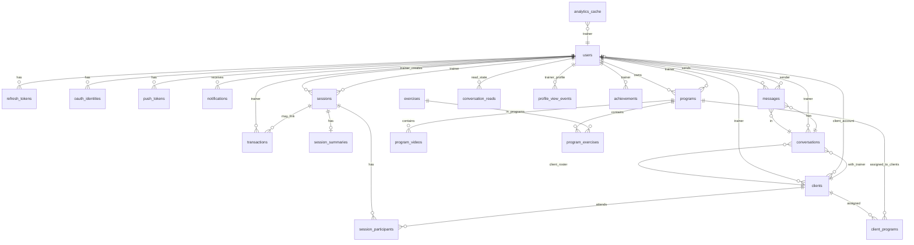
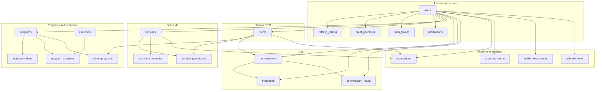

# Database schema tree (FitConnect)

Візуальна карта сутностей і зв’язків. Деталі колонок — у [DB_STRUCTURE.md](DB_STRUCTURE.md).

---

## 1. Діаграма зв’язків (ER)

---

## 2. Логічні шари (хто від кого залежить)

Окремі блоки — **не** окремі БД-схеми, а зручне групування для читання.

---

## 3. Таблиці по доменах

### Identity and access

| Таблиця | Зв’язок | Кратність |
|---------|---------|-----------|
| `users` | коренева сутність користувача | 1 |
| `refresh_tokens` | `user_id` → `users` | N : 1 |
| `oauth_identities` | `user_id` → `users` | N : 1 |
| `push_tokens` | `user_id` → `users` | N : 1 |
| `notifications` | `user_id` → `users` | N : 1 |

### Trainer CRM

| Таблиця | Зв’язок | Кратність |
|---------|---------|-----------|
| `clients` | `trainer_id` → `users` | N : 1 |
| `clients` | `client_user_id` → `users` (опційно) | N : 1 |

### Schedule

| Таблиця | Зв’язок | Кратність |
|---------|---------|-----------|
| `sessions` | `trainer_id` → `users` | N : 1 |
| `session_participants` | `session_id` + `client_id` | M : N між `sessions` і `clients` |
| `session_summaries` | `session_id` → `sessions` | 0..1 : 1 |

### Programs and library

| Таблиця | Зв’язок | Кратність |
|---------|---------|-----------|
| `programs` | `trainer_id` → `users` | N : 1 |
| `program_videos` | `program_id` → `programs` | N : 1 |
| `exercises` | довідник вправ | 1 |
| `program_exercises` | `program_id` + `exercise_id` | M : N між `programs` і `exercises` |
| `client_programs` | `client_id` + `program_id` | M : N між `clients` і `programs` |

### Chat

| Таблиця | Зв’язок | Кратність |
|---------|---------|-----------|
| `conversations` | `trainer_id` → `users`, `client_id` → `clients` | одна пара trainer–client |
| `messages` | `conversation_id` → `conversations`, `sender_id` → `users` | N : 1 |
| `conversation_reads` | `conversation_id` + `user_id` | стан прочитання |

### Money and analytics

| Таблиця | Зв’язок | Кратність |
|---------|---------|-----------|
| `transactions` | `trainer_id` → `users`; опційно `client_id`, `session_id` | N : 1 |
| `analytics_cache` | `trainer_id` → `users` | N : 1 |
| `profile_view_events` | `trainer_id` → `users` | N : 1 |
| `achievements` | `trainer_id` → `users` | N : 1 |

---

## 4. Легенда (ER-нотація)

| У Mermaid ER | Значення |
|--------------|----------|
| `||--o{` | один до багатьох |
| `}o--o|` | багато до одного, FK опційний |
| `}o--||` | багато до одного, FK обов’язковий |
