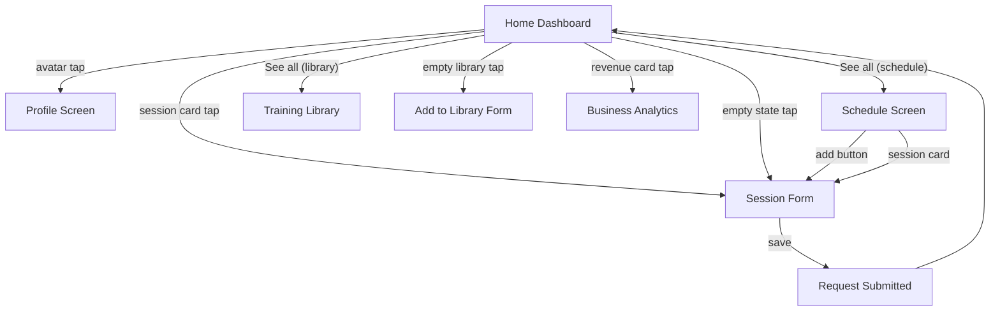

# Home Dashboard Flow — Full Specification

## 1. Flow Diagram



---

## 2. Screens and Data Sources

### 2.1 Home Dashboard

| Section | Data Source | Store |
|---------|-----------|-------|
| Welcome header (avatar + name) | `appStore.userName` | `appStore` |
| Points badge | `appStore.points` | `appStore` |
| Notification bell + dot | Session count for today | `sessionsStore` |
| Revenue card ($320) | Mock (future: `GET /analytics/revenue`) | — |
| Profile views card (123) | Mock (future: `GET /analytics/profile-views`) | — |
| Training Library cards | `programsStore.programs` | `programsStore` |
| Schedule session cards | `sessionsStore.getUpcomingSessions()` | `sessionsStore` |

**Features:**
- Pull-to-refresh (simulated, future: re-fetch from API)
- Empty state for Training Library (CTA to create first program)
- Empty state for Schedule (CTA to create first session)
- Revenue card navigates to Business Analytics tab
- Notification dot visible when today has sessions

---

### 2.2 Schedule

| Section | Data Source | Store |
|---------|-----------|-------|
| Session list | `sessionsStore.sessions` | `sessionsStore` |
| Day/week/month views | Computed from sessions + date math | `sessionsStore` |
| Search | `sessionsStore.searchSessions(query)` | `sessionsStore` |
| Delete session | `sessionsStore.deleteSession(id)` | `sessionsStore` |

**Features:**
- Day picker horizontal strip (90 days ahead)
- Month selector with chevrons
- Swipe gesture to switch day/week/month views
- Search filters by title, type, participant name
- Context menu (reschedule/edit/cancel) per session card
- Empty state when no sessions for selected day

---

### 2.3 Session Form

| Field | Type | Required | Validation | Store |
|-------|------|----------|------------|-------|
| title | string | yes | min 2 chars | local state |
| date | string | yes | non-empty | local state |
| time | string | yes | non-empty | local state |
| participants | string[] | no | — | local state |
| type | string | yes | from predefined list | local state |

**Behavior:**
- **Create mode** (no session param): calls `sessionsStore.addSession(...)` with status `'pending'`
- **Edit mode** (session param): calls `sessionsStore.updateSession(id, ...)`, preserves existing status
- Both navigate to RequestSubmitted on success

---

## 3. Store Schema

### sessionsStore (Zustand)

```typescript
interface SessionsState {
  sessions: Session[];
  addSession: (session: Omit<Session, 'id'>) => void;
  updateSession: (id: string, updates: Partial<Omit<Session, 'id'>>) => void;
  deleteSession: (id: string) => void;
  getSessionsByDateKey: (dateKey: string) => Session[];
  searchSessions: (query: string) => Session[];
  getTodaySessions: () => Session[];
  getUpcomingSessions: () => Session[];
}
```

Seeded with mock data from `src/mocks/data.ts`. Counter auto-generates IDs for new sessions.

---

## 4. Backend API Contract (for future integration)

### 4.1 Get Sessions

**`GET /sessions`**

Query params: `?date=2026-04-07&q=search+term`

```json
// Response 200
{
  "sessions": [
    {
      "id": "uuid",
      "title": "Personal Session",
      "type": "HIIT",
      "date": "2026-04-07",
      "time": "10:00",
      "status": "pending",
      "participants": [
        { "id": "client-uuid", "name": "Darrell Steward", "avatar": "url" }
      ],
      "trainerId": "trainer-uuid",
      "createdAt": "2026-04-01T12:00:00Z"
    }
  ],
  "total": 6
}
```

---

### 4.2 Create Session

**`POST /sessions`**

```json
// Request
{
  "title": "Cardio Class",
  "type": "Cardio",
  "date": "2026-04-10",
  "time": "14:00",
  "participantIds": ["client-uuid-1", "client-uuid-2"]
}
```

```json
// Response 201
{
  "id": "new-session-uuid",
  "title": "Cardio Class",
  "type": "Cardio",
  "date": "2026-04-10",
  "time": "14:00",
  "status": "pending",
  "participants": [...],
  "createdAt": "2026-04-07T12:00:00Z"
}
```

---

### 4.3 Update Session

**`PATCH /sessions/:id`**

```json
// Request (partial)
{
  "title": "Updated Title",
  "time": "15:00"
}
```

```json
// Response 200 — full session object
```

---

### 4.4 Delete Session

**`DELETE /sessions/:id`**

```json
// Response 204 (no content)
```

---

### 4.5 Get Analytics Summary (for stat cards)

**`GET /analytics/summary`**

```json
// Response 200
{
  "revenue": { "total": 320, "currency": "USD", "period": "month" },
  "profileViews": { "total": 123, "period": "month" },
  "sessionsToday": 3,
  "totalClients": 12
}
```

---

## 5. DB Tables Involved

| Table | Usage |
|-------|-------|
| `sessions` | `trainer_id`, `title`, `type`, `scheduled_date`, `scheduled_time`, `status` |
| `session_participants` | Links `session_id` to `client_id` (M:N) |
| `users` | `name`, `avatar_url`, `points` for header |
| `programs` | Training library cards |
| `analytics_cache` | Revenue and profile view aggregates |

---

## 6. Error & Edge Case Handling

| Scenario | Behavior |
|----------|----------|
| No sessions exist | Empty state card with CTA to create |
| No programs exist | Empty state card with CTA to add program |
| Pull-to-refresh | Simulated 800ms delay (future: re-fetch from API) |
| Session form empty title | Inline error, save blocked |
| Delete session | Confirm dialog, removed from store immediately |
| Network error on API (future) | Toast notification + retry |
