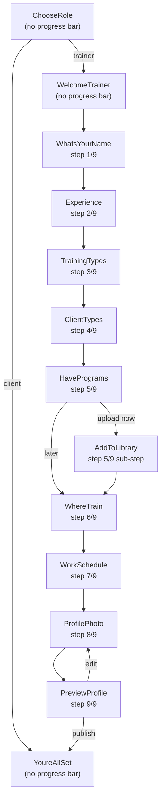

# Onboarding Flow — Full Specification

> Scope: Trainer onboarding (client onboarding is deferred to a later phase)

## 1. Flow Diagram



Every step except ChooseRole, WelcomeTrainer, and YoureAllSet has a **Skip** button that advances without saving the current screen's data.

---

## 2. Screens and Data Contract

### 2.1 ChooseRole

| Field | Type | Required | Store |
|-------|------|----------|-------|
| role | `'client' \| 'trainer'` | yes | `appStore.userRole` |

**Behavior:** Trainer advances to WelcomeTrainer. Client advances to YoureAllSet (deferred).

---

### 2.2 WelcomeTrainer

No data collected. Informational screen with "Let's Go" CTA.

---

### 2.3 WhatsYourName

| Field | Type | Required | Validation | Store |
|-------|------|----------|------------|-------|
| name | string | yes (soft) | min 2 chars, max 100 chars, trimmed | `onboardingStore.name`, syncs to `appStore.userName` |

**Validation:** Inline error below input when name is < 2 chars on blur. Next button disabled (grayed, no action) when empty.

---

### 2.4 Experience

| Field | Type | Required | Validation | Store |
|-------|------|----------|------------|-------|
| experienceYears | string enum | no | one of predefined options | `onboardingStore.experienceYears` |
| hasCertifications | boolean | no | — | `onboardingStore.hasCertifications` |
| certifications | `{ name: string; uri: string }[]` | no | each must have uri | `onboardingStore.certifications` |

**Upload:** "Upload certificate" opens `expo-document-picker` (PDF/image). Adds to `certifications` array with filename and local URI. Preview as removable chips. Backend will receive these as file uploads during profile save.

---

### 2.5 TrainingTypes

| Field | Type | Required | Validation | Store |
|-------|------|----------|------------|-------|
| trainingTypes | string[] | soft min 1 | at least 1 recommended, warning toast if 0 | `onboardingStore.trainingTypes` |

**Options:** Strength, Yoga, Cardio, HIIT, Mobility, Pilates, Other

---

### 2.6 ClientTypes

| Field | Type | Required | Validation | Store |
|-------|------|----------|------------|-------|
| clientTypes | string[] | soft min 1 | at least 1 recommended, warning toast if 0 | `onboardingStore.clientTypes` |

**Options:** Beginners, Pro, Women, Men, 50+, Strength, Other

---

### 2.7 HavePrograms

| Field | Type | Required | Store |
|-------|------|----------|-------|
| hasPrograms | boolean | yes (implicit by tap) | `onboardingStore.hasPrograms` |

**Branches:** "Upload now" -> AddToLibrary; "Add later" -> WhereTrain.

---

### 2.8 AddToLibrary

| Field | Type | Required | Validation | Store |
|-------|------|----------|------------|-------|
| programTitle | string | yes | min 2 chars | `onboardingStore.programTitle` |
| programDescription | string | no | max 500 chars | `onboardingStore.programDescription` |
| freePreview | boolean | no | — | `onboardingStore.freePreview` |
| accessSetting | `'public' \| 'subscribers' \| 'private'` | no | — | `onboardingStore.accessSetting` |

**Upload areas:** placeholder UI only (real media upload is a post-MVP feature). Continue requires non-empty title.

---

### 2.9 WhereTrain

| Field | Type | Required | Validation | Store |
|-------|------|----------|------------|-------|
| locations | string[] | soft min 1 | at least 1 recommended | `onboardingStore.locations` |

**Options:** Online, In-person at client's home, At the gym, Outdoors

---

### 2.10 WorkSchedule

| Field | Type | Required | Validation | Store |
|-------|------|----------|------------|-------|
| workDays | string[] | no | valid day names | `onboardingStore.workDays` (upgraded to string[]) |
| workTimeStart | string | no | HH:mm format | `onboardingStore.workTimeStart` |
| workTimeEnd | string | no | end > start | `onboardingStore.workTimeEnd` |
| sameSlotsEveryWeek | boolean | no | — | `onboardingStore.sameSlotsEveryWeek` |

**Interaction:** Days row opens a multi-select chip picker (Mon-Sun). Time row opens native time pickers via `@react-native-community/datetimepicker`.

---

### 2.11 ProfilePhoto

| Field | Type | Required | Validation | Store |
|-------|------|----------|------------|-------|
| profilePhotoUri | string or null | no | valid image from picker | `onboardingStore.profilePhotoUri` |

**Interaction:** Tap upload circle opens `expo-image-picker` (camera or gallery). Selected image previewed in circle. Remove button to clear.

---

### 2.12 PreviewProfile

Read-only summary of all collected data:

| Data | Source |
|------|--------|
| Avatar | `onboardingStore.profilePhotoUri` -> Avatar component with `uri` prop |
| Name | `onboardingStore.name` or fallback "Trainer" |
| Title | auto-generated from `trainingTypes` (e.g., "HIIT & Yoga Coach") |
| Location | `onboardingStore.locations` joined |
| Experience | `onboardingStore.experienceYears` |
| Certifications count | `onboardingStore.certifications.length` |
| Availability | `onboardingStore.workDays` joined + time range |
| Training types | `onboardingStore.trainingTypes` as tags |
| Client types | `onboardingStore.clientTypes` as tags |
| Has programs | `onboardingStore.hasPrograms` indicator |

**Actions:** "Publish Profile" -> YoureAllSet. "Edit Info" -> goBack.

---

### 2.13 YoureAllSet

**Actions:**
- "Go to Homepage" -> `resetOnboarding()` + `setOnboarded(true)` -> switches to MainTabNavigator
- "View your profile" -> `resetOnboarding()` + `setOnboarded(true)` -> navigates to Profile screen after switch

**Points:** +20 points badge (visual, stored in `appStore.points` when backend integrates).

---

## 3. Store Schema

### onboardingStore (Zustand)

```typescript
interface OnboardingState {
  // Step 1
  name: string;

  // Step 2
  experienceYears: string;
  hasCertifications: boolean;
  certifications: { name: string; uri: string }[];

  // Step 3
  trainingTypes: string[];

  // Step 4
  clientTypes: string[];

  // Step 5
  hasPrograms: boolean;
  programTitle: string;
  programDescription: string;
  freePreview: boolean;
  accessSetting: 'public' | 'subscribers' | 'private';

  // Step 6
  locations: string[];

  // Step 7
  workDays: string[];              // ['Monday', 'Tuesday', ...]
  workTimeStart: string;           // 'HH:mm'
  workTimeEnd: string;             // 'HH:mm'
  sameSlotsEveryWeek: boolean;

  // Step 8
  profilePhotoUri: string | null;

  // Actions
  setField: <K extends keyof OnboardingState>(key: K, value: OnboardingState[K]) => void;
  toggleTrainingType: (type: string) => void;
  toggleClientType: (type: string) => void;
  toggleLocation: (location: string) => void;
  addCertification: (cert: { name: string; uri: string }) => void;
  removeCertification: (uri: string) => void;
  toggleWorkDay: (day: string) => void;
  reset: () => void;
}
```

### appStore (Zustand)

```typescript
interface AppState {
  isOnboarded: boolean;
  userRole: 'client' | 'trainer' | null;
  userName: string | null;
  points: number;
  setOnboarded: (value: boolean) => void;
  setUserRole: (role: 'client' | 'trainer' | null) => void;
  setUserName: (name: string | null) => void;
  addPoints: (amount: number) => void;
  reset: () => void;
}
```

---

## 4. Validation Rules (zod schemas)

```typescript
import { z } from 'zod';

export const nameSchema = z.string().trim().min(2, 'Name must be at least 2 characters').max(100);

export const experienceSchema = z.object({
  experienceYears: z.string().optional(),
  hasCertifications: z.boolean(),
  certifications: z.array(z.object({
    name: z.string(),
    uri: z.string().url(),
  })),
});

export const trainingTypesSchema = z.array(z.string()).min(1, 'Select at least one training type');

export const clientTypesSchema = z.array(z.string()).min(1, 'Select at least one client type');

export const locationsSchema = z.array(z.string()).min(1, 'Select at least one location');

export const workScheduleSchema = z.object({
  workDays: z.array(z.string()),
  workTimeStart: z.string().regex(/^\d{2}:\d{2}$/),
  workTimeEnd: z.string().regex(/^\d{2}:\d{2}$/),
  sameSlotsEveryWeek: z.boolean(),
});

export const programSchema = z.object({
  programTitle: z.string().trim().min(2, 'Title must be at least 2 characters'),
  programDescription: z.string().max(500).optional(),
  freePreview: z.boolean(),
  accessSetting: z.enum(['public', 'subscribers', 'private']),
});
```

---

## 5. Backend API Contract (for future integration)

### 5.1 Complete Onboarding Profile

**`PATCH /user/profile`**

Called on "Publish Profile" from PreviewProfileScreen. Sends all collected onboarding data in one request.

```json
// Request body
{
  "name": "Sarah Johnson",
  "role": "trainer",
  "experience": "4-6 years",
  "certifications": ["AWS Certified Trainer"],
  "trainingTypes": ["HIIT", "Cardio", "Yoga"],
  "clientTypes": ["Beginners", "Women", "50+"],
  "locations": ["Online", "At the gym"],
  "workSchedule": {
    "days": ["Monday", "Tuesday", "Wednesday", "Thursday", "Friday"],
    "startTime": "09:00",
    "endTime": "18:00"
  }
}
```

```json
// Response 200
{
  "id": "uuid",
  "name": "Sarah Johnson",
  "avatar": null,
  "role": "trainer",
  "points": 20,
  "experience": "4-6 years",
  "certifications": ["AWS Certified Trainer"],
  "trainingTypes": ["HIIT", "Cardio", "Yoga"],
  "clientTypes": ["Beginners", "Women", "50+"],
  "locations": ["Online", "At the gym"],
  "workSchedule": {
    "days": ["Monday", "Tuesday", "Wednesday", "Thursday", "Friday"],
    "startTime": "09:00",
    "endTime": "18:00"
  },
  "onboardingCompletedAt": "2026-04-07T12:00:00Z"
}
```

**Error responses:**

| Status | Body | When |
|--------|------|------|
| 400 | `{ "error": "validation_error", "details": [...] }` | Invalid field values |
| 401 | `{ "error": "unauthorized" }` | No valid auth token |
| 500 | `{ "error": "internal_error" }` | Server failure |

---

### 5.2 Upload Avatar

**`POST /user/avatar`**

Called after selecting a profile photo. Separate from profile PATCH to handle multipart upload.

```
Content-Type: multipart/form-data

file: <image binary>
```

```json
// Response 200
{
  "avatar": "https://storage.example.com/avatars/uuid.jpg"
}
```

**Constraints:**
- Max file size: 5MB
- Accepted formats: JPEG, PNG, WebP
- Server resizes to 300x300 minimum, stores original + thumbnail

---

### 5.3 Upload Certificate

**`POST /user/certifications`**

Called per certificate file during onboarding.

```
Content-Type: multipart/form-data

file: <PDF or image binary>
name: "AWS Certified Personal Trainer"
```

```json
// Response 201
{
  "id": "cert-uuid",
  "name": "AWS Certified Personal Trainer",
  "fileUrl": "https://storage.example.com/certs/uuid.pdf",
  "createdAt": "2026-04-07T12:00:00Z"
}
```

---

### 5.4 Mark Onboarding Complete

**`POST /user/onboarding/complete`**

Called after "Publish Profile". Sets `onboarding_completed_at` timestamp and awards initial points.

```json
// Request body (empty or optional)
{}
```

```json
// Response 200
{
  "onboardingCompletedAt": "2026-04-07T12:00:00Z",
  "pointsAwarded": 20,
  "totalPoints": 20,
  "achievement": {
    "id": "profile-complete",
    "title": "Profile Complete",
    "description": "Earn more achievements by updating your profile and staying on top",
    "points": 20
  }
}
```

---

### 5.5 Create Program (from onboarding AddToLibrary)

**`POST /programs`**

Optional — only if user chose "upload now" on HavePrograms.

```json
// Request body
{
  "title": "Morning HIIT Routine",
  "description": "A 30-minute high-intensity interval training...",
  "accessSetting": "public",
  "freePreview": true
}
```

```json
// Response 201
{
  "id": "program-uuid",
  "title": "Morning HIIT Routine",
  "description": "A 30-minute high-intensity interval training...",
  "accessSetting": "public",
  "freePreview": true,
  "createdAt": "2026-04-07T12:00:00Z"
}
```

---

## 6. DB Tables Involved

From [DB_STRUCTURE.md](../backend/DB_STRUCTURE.md):

| Table | Onboarding Usage |
|-------|-----------------|
| `users` | `name`, `role`, `avatar_url`, `experience`, `certifications` (JSONB), `training_types` (JSONB), `client_types` (JSONB), `locations` (JSONB), `work_schedule_start`, `work_schedule_end`, `work_schedule_days` (JSONB), `onboarding_completed_at`, `points` |
| `programs` | Optional program created during AddToLibrary step |
| `achievements` | "Profile Complete" achievement record with +20 points |

---

## 7. Error & Edge Case Handling

| Scenario | Behavior |
|----------|----------|
| User kills app mid-onboarding | Zustand state lost (no persistence). On next launch, starts from ChooseRole. Future: persist to AsyncStorage |
| Empty name and user taps Next | Next button disabled, inline error "Name must be at least 2 characters" |
| No training types selected, taps Next | Warning toast "We recommend selecting at least one", but allows proceed |
| No locations selected | Same as above |
| Image picker permission denied | Show alert with "Go to Settings" button |
| Image too large (>5MB) | Show error toast, don't save to store |
| Time end before time start | Inline error on time picker, prevent save |
| Network error on publish | Show retry dialog (future, when API integrated) |

---

## 8. Accessibility Requirements

| Element | Requirement |
|---------|-------------|
| Role selection cards | `accessibilityRole="radio"`, `accessibilityState={{ checked }}` |
| Multi-select chips (types, locations) | `accessibilityRole="checkbox"`, `accessibilityState={{ checked }}` |
| Skip button | `accessibilityRole="button"`, `accessibilityLabel="Skip this step"` |
| Next/Back buttons | Already via IconButton, ensure `accessibilityLabel` |
| Upload areas | `accessibilityRole="button"`, `accessibilityLabel="Upload photo"` / `"Upload certificate"` |
| Progress indicator | `accessibilityLabel="Step {current} of {total}"` |
| Input fields | `accessibilityLabel` matching label text |
| Error messages | `accessibilityLiveRegion="polite"` for dynamic errors |
