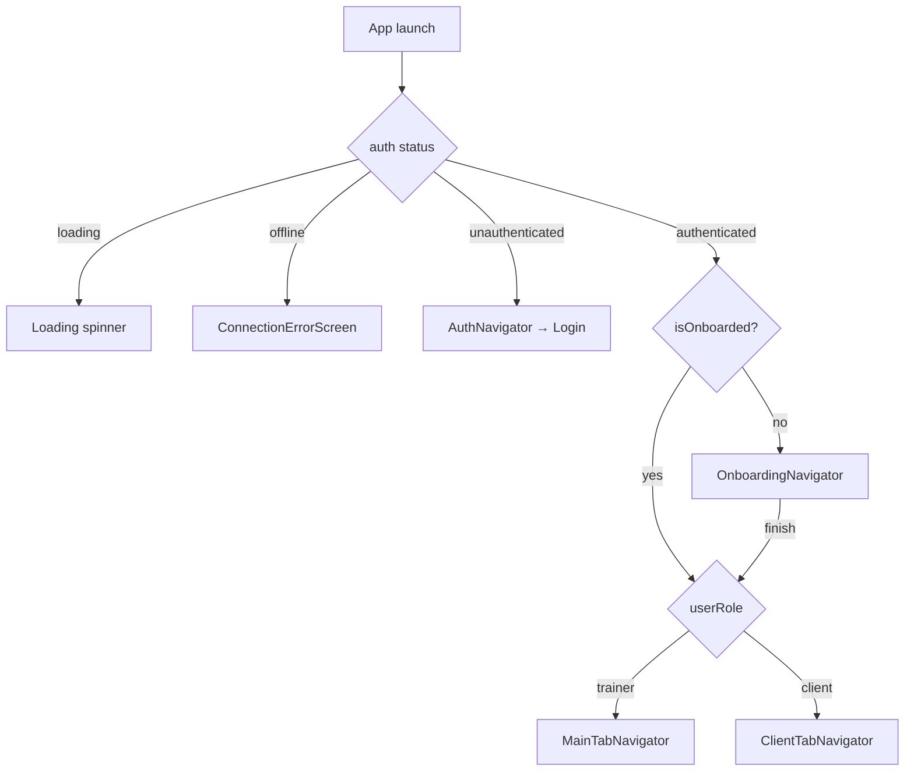
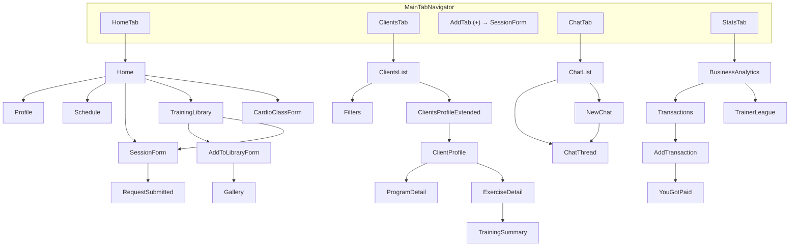
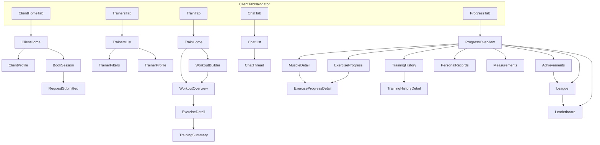

# FitConnect — карта екранів і навігації

> **Дата:** 2026-06-15
> **Джерело:** побудовано з реального коду навігаторів (`src/navigation/*`) та `navigation`-викликів
> в екранах — відображає **фактичні** маршрути, а не припущення.
> **Архітектура:** «один бінарник, дві ролі». `RootNavigator` гейтить вхід за станом auth →
> онбординг → роль і показує **повністю окремі** дерева вкладок для тренера (`MainTabNavigator`)
> і клієнта (`ClientTabNavigator`).

---

## 0. Кореневий гейт (RootNavigator)

`src/navigation/RootNavigator.tsx` — точка входу. Рішення за станом:

```
status === 'loading'        → індикатор завантаження
status === 'offline'        → ConnectionErrorScreen (токен цілий, але бекенд недоступний → retry)
status === 'unauthenticated'→ AuthNavigator (Login)
authenticated & !isOnboarded→ OnboardingNavigator
authenticated &  isOnboarded→ userRole === 'client' ? ClientTabNavigator : MainTabNavigator
```



---

## 1. Auth + Онбординг (спільні)

### Auth
`AuthNavigator` (`src/navigation/AuthNavigator.tsx`) містить лише **один** екран:
- **Login** (`src/screens/auth/LoginScreen.tsx`) — email/пароль. **Немає** екранів реєстрації,
  forgot-password, social-login (API для них існує, UI — ні).

### Онбординг (один стек для обох ролей)
`OnboardingNavigator` (`src/navigation/OnboardingNavigator.tsx`). Резюмується з останнього незавершеного
кроку (`RESUMABLE_ROUTES`, стан у `onboardingStore.currentRoute`). Гілкування за роллю — на `ChooseRole`.

```mermaid
flowchart LR
    CR[ChooseRole] --> W[Welcome]
    W --> N[WhatsYourName]
    N --> E[Experience]
    E --> TT[TrainingTypes]
    TT --> CT2[ClientTypes]
    CT2 --> WT[WhereTrain]
    WT --> WS[WorkSchedule]
    WS --> TP[TrainerPreferences]
    TP --> PP[ProfilePhoto]
    PP --> PV[PreviewProfile]
    PV --> YAS[YoureAllSet]
    YAS -->|isOnboarded=true| ROOT[Root → роль]
```



Послідовність екранів (`OnboardingNavigator.tsx:86-97`): `ChooseRole → Welcome → WhatsYourName →
Experience → TrainingTypes → ClientTypes → WhereTrain → WorkSchedule → TrainerPreferences →
ProfilePhoto → PreviewProfile → YoureAllSet`. Деякі кроки рендеряться по-різному або пропускаються
залежно від ролі (напр. `TrainerPreferences` — клієнтський крок переваг тренера; `WorkSchedule` /
`CertificationUpload` на `Experience` — тренерські).

---

## 2. Дерево навігації — ТРЕНЕР (MainTabNavigator)

5 вкладок (`src/navigation/MainTabNavigator.tsx`). Центральна вкладка **AddTab** — це не екран, а
кнопка-ярлик: `navigate('HomeTab', { screen: 'SessionForm' })` (`MainTabNavigator.tsx:127`).



**Стеки тренера:**
- **HomeStack** (`HomeStackNavigator.tsx`): `Home, Profile, Schedule, SessionForm,
  RequestSubmitted, TrainingLibrary, AddToLibraryForm, Gallery, CardioClassForm`.
- **ClientsStack** (`ClientsStackNavigator.tsx`): `ClientsList, Filters, ClientProfile,
  ProgramDetail, ExerciseDetail, ClientsProfileExtended, TrainingSummary`. (Стек тримає
  `useRestTimer()` живим; `ExerciseDetail`/`TrainingSummary` ховають таб-бар.)
- **ChatStack** (`ChatStackNavigator.tsx`): `ChatList, ChatThread, NewChat`.
- **StatsStack** (`StatsStackNavigator.tsx`): `BusinessAnalytics, Transactions, AddTransaction,
  YouGotPaid, TrainerLeague`.

---

## 3. Дерево навігації — КЛІЄНТ (ClientTabNavigator)

5 вкладок (`src/navigation/ClientTabNavigator.tsx`): `ClientHomeTab, TrainersTab, TrainTab, ChatTab,
ProgressTab`. (ChatTab перевикористовує спільний `ChatStackNavigator`.)



**Стеки клієнта:**
- **ClientHomeStack** (`client/ClientHomeStackNavigator.tsx`): `ClientHome, ClientProfile,
  BookSession, RequestSubmitted` (RequestSubmitted перевикористаний з тренерського `home`).
- **TrainersStack** (`client/TrainersStackNavigator.tsx`): `TrainersList, TrainerFilters,
  TrainerProfile`.
- **TrainStack** (`client/TrainStackNavigator.tsx`): `TrainHome, WorkoutBuilder, WorkoutOverview,
  ExerciseDetail, TrainingSummary` (тримає `useRestTimer()`; `ExerciseDetail`/`TrainingSummary`
  спільні з тренером).
- **ProgressStack** (`client/ProgressStackNavigator.tsx`): `ProgressOverview, MuscleDetail,
  ExerciseProgress, ExerciseProgressDetail, TrainingHistory, TrainingHistoryDetail, PersonalRecords,
  Measurements, Achievements, League, Leaderboard`.
- **ChatStack** — спільний із тренером.

> **Крос-табова навігація:** клієнтський свайп між вкладками працює лише Home↔Trainers↔Progress
> (`useClientTabSwipe.ts`), Train і Chat — лише тапом. «Message» з картки тренера/головної перекидає
> у ChatTab.

---

## 4. Реєстр усіх екранів

Роль: **T** = тренер, **C** = клієнт, **S** = спільний. Дані: **Live** = є API-виклик,
**Mock** = локальний стор/seed, **Mixed** = частина live / частина mock, **Local** = лише UI-стан.

### Auth / Онбординг (спільні)
| Екран | Файл | Роль | Як потрапити | Дані |
|-------|------|------|--------------|------|
| Login | `screens/auth/LoginScreen.tsx` | S | старт, якщо `unauthenticated` | Live (auth) |
| ConnectionError | `screens/ConnectionErrorScreen.tsx` | S | `status==='offline'` | — |
| ChooseRole | `screens/onboarding/steps/ChooseRoleScreen.tsx` | S | старт онбордингу | Local |
| Welcome | `…/WelcomeScreen.tsx` | S | після ChooseRole | Local |
| WhatsYourName | `…/WhatsYourNameScreen.tsx` | S | після Welcome | Local |
| Experience | `…/ExperienceScreen.tsx` (+ CertificationUpload для T) | S | після Name | Local |
| TrainingTypes | `…/TrainingTypesScreen.tsx` | S | після Experience | Local |
| ClientTypes | `…/ClientTypesScreen.tsx` | S | після TrainingTypes | Local |
| WhereTrain | `…/WhereTrainScreen.tsx` | S | після ClientTypes | Local |
| WorkSchedule | `…/WorkScheduleScreen.tsx` | T | після WhereTrain | Local |
| TrainerPreferences | `…/TrainerPreferencesScreen.tsx` | C | після WorkSchedule | Local |
| ProfilePhoto | `…/ProfilePhotoScreen.tsx` | S | після TrainerPreferences | Local |
| PreviewProfile | `…/PreviewProfileScreen.tsx` | S | після ProfilePhoto | Local |
| YoureAllSet | `…/YoureAllSetScreen.tsx` | S | фінал онбордингу → Root | Mock (фейк submit) |

### Тренер
| Екран | Файл | Як потрапити | Дані |
|-------|------|--------------|------|
| Home | `screens/home/screens/HomeScreen.tsx` | HomeTab (старт) | Mixed |
| Profile | `…/ProfileScreen.tsx` | Home → avatar | Mock (onboardingStore) |
| Schedule | `…/ScheduleScreen.tsx` | Home → «See all»/розклад | Mock (sessionsStore) |
| SessionForm | `…/SessionFormScreen.tsx` | AddTab (+), Home, TrainingLibrary | Mock |
| RequestSubmitted | `…/RequestSubmittedScreen.tsx` | після SessionForm submit | Mock |
| TrainingLibrary | `…/TrainingLibraryScreen.tsx` | Home → «See all» програм | Live (programs) |
| AddToLibraryForm | `…/AddToLibraryFormScreen.tsx` | TrainingLibrary → «+»/edit | Mock (draftStore) |
| Gallery | `…/GalleryScreen.tsx` | AddToLibraryForm → «Continue» | Live (exercises) |
| CardioClassForm | `…/CardioClassFormScreen.tsx` | прямий navigate (не в осн. UI) | Mock |
| ClientsList | `screens/clients/ClientsListScreen.tsx` | ClientsTab (старт) | Live+fallback (clients) |
| Filters | `screens/clients/FiltersScreen.tsx` | ClientsList → фільтри | Local (не застосовується) |
| ClientsProfileExtended | `…/ClientsProfileExtendedScreen.tsx` | ClientsList → картка | Mixed |
| ClientProfile | `…/ClientProfileScreen.tsx` | «Start Training» (Home/ClientsExtended) | Mock (activeTraining) |
| ProgramDetail | `…/ProgramDetailScreen.tsx` | ClientProfile → програма | Mock |
| ExerciseDetail | `screens/training/ExerciseDetailScreen.tsx` | ClientProfile → вправа | Mock (activeTraining) |
| TrainingSummary | `screens/training/TrainingSummaryScreen.tsx` | фінал живої сесії | Mock |
| BusinessAnalytics | `screens/stats/BusinessAnalyticsScreen.tsx` | StatsTab (старт) | Mixed (txns Live, агрегати Mock) |
| Transactions | `…/TransactionsScreen.tsx` | BusinessAnalytics → «See all» | Mock |
| AddTransaction | `…/AddTransactionScreen.tsx` | Transactions → edit/«+» | Local (не зберігає) |
| YouGotPaid | `…/YouGotPaidScreen.tsx` | після AddTransaction submit | Mock |
| TrainerLeague | `…/TrainerLeagueScreen.tsx` | BusinessAnalytics → league | Live (gamification) |

### Клієнт
| Екран | Файл | Як потрапити | Дані |
|-------|------|--------------|------|
| ClientHome | `screens/client/home/ClientHomeScreen.tsx` | ClientHomeTab (старт) | Mixed |
| ClientProfile | `…/ClientProfileScreen.tsx` | ClientHome → avatar | Mock |
| BookSession | `…/BookSessionScreen.tsx` | ClientHome → «Book»/карусель | Local (не сповіщає) |
| RequestSubmitted | `screens/home/…/RequestSubmittedScreen.tsx` | після BookSession | Mock |
| TrainersList | `screens/client/trainers/TrainersListScreen.tsx` | TrainersTab (старт) | Mock |
| TrainerFilters | `…/TrainerFiltersScreen.tsx` | TrainersList → фільтри | Local |
| TrainerProfile | `…/TrainerProfileScreen.tsx` | TrainersList → картка | Mock |
| TrainHome | `screens/client/train/TrainHomeScreen.tsx` | TrainTab (старт) | Mock |
| WorkoutBuilder | `…/WorkoutBuilderScreen.tsx` | TrainHome → «Build your own» | Mock (exercises) |
| WorkoutOverview | `…/WorkoutOverviewScreen.tsx` | TrainHome/Builder → програма | Mock |
| ExerciseDetail | `screens/training/ExerciseDetailScreen.tsx` | WorkoutOverview → start | Mock |
| TrainingSummary | `screens/training/TrainingSummaryScreen.tsx` | фінал тренування | Mock (не зберігає в API) |
| ProgressOverview | `screens/client/progress/ProgressOverviewScreen.tsx` | ProgressTab (старт) | Mock |
| MuscleDetail | `…/MuscleDetailScreen.tsx` | ProgressOverview → body map | Mock |
| ExerciseProgress | `…/ExerciseProgressScreen.tsx` | ProgressOverview → quick-link | Mock |
| ExerciseProgressDetail | `…/ExerciseProgressDetailScreen.tsx` | MuscleDetail/ExerciseProgress | Mock |
| TrainingHistory | `…/TrainingHistoryScreen.tsx` | ProgressOverview → quick-link | Mock |
| TrainingHistoryDetail | `…/TrainingHistoryDetailScreen.tsx` | TrainingHistory → запис | Mock |
| PersonalRecords | `…/PersonalRecordsScreen.tsx` | ProgressOverview → quick-link | Mock |
| Measurements | `…/MeasurementsScreen.tsx` | ProgressOverview → quick-link | Mock (лише вага) |
| Achievements | `…/AchievementsScreen.tsx` | ProgressOverview → quick-link | Live (gamification) |
| League | `…/LeagueScreen.tsx` | ProgressOverview/Achievements | Live (gamification) |
| Leaderboard | `…/LeaderboardScreen.tsx` | League → «View leaderboards» | Live (gamification) |

### Спільні (Chat — для обох ролей)
| Екран | Файл | Як потрапити | Дані |
|-------|------|--------------|------|
| ChatList | `screens/chat/ChatListScreen.tsx` | ChatTab (старт) | Mock (`chat:false`) |
| ChatThread | `screens/chat/ChatThreadScreen.tsx` | ChatList → розмова, «Message» | Mock |
| NewChat | `screens/chat/NewChatScreen.tsx` | ChatList → «+» | Mock |

---

## 5. Зведення

- **Тренер:** ~21 унікальний екран у 4 стеках + центральна кнопка «+».
- **Клієнт:** ~23 екрани у 4 стеках (Chat спільний).
- **Спільні:** 1 auth + 12 онбординг-кроків + 3 chat + 2 training (`ExerciseDetail`,
  `TrainingSummary`, що перевикористовуються обома ролями).
- **Live API:** auth, programs, exercises, clients(+fallback), gamification (league/leaderboard/
  achievements), частина transactions у Business Analytics.
- **Mock / не підключено:** chat (повністю), analytics-агрегати, бронювання/підтвердження сесій,
  призначення тренувань клієнту, заявки Connect, збереження транзакцій/тренувань (детальніше — у
  документі Voice of Customer).

---

*Карту згенеровано читанням навігаторів станом на 2026-06-15. Код застосунку не змінювався.*
